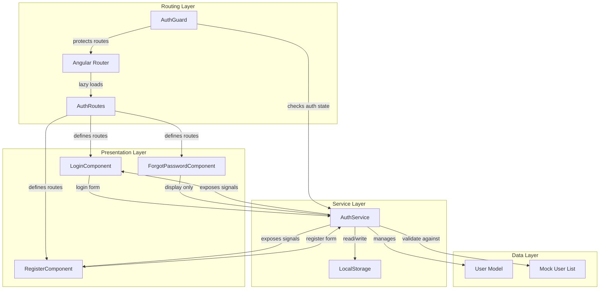
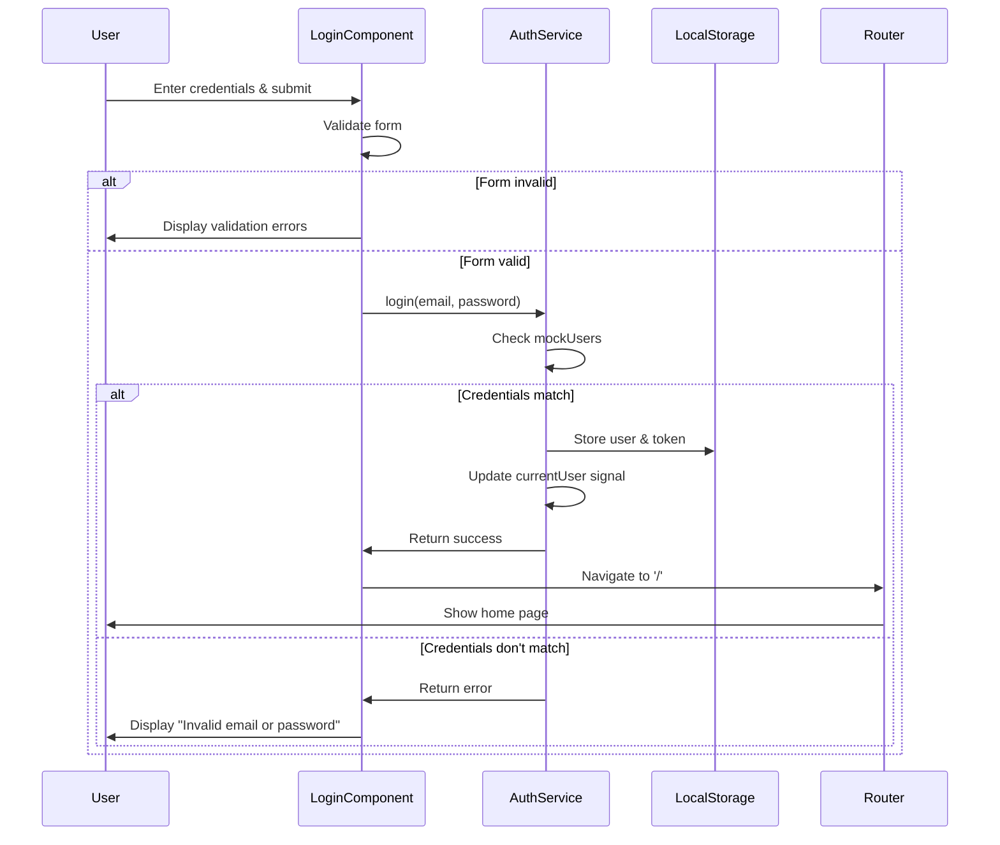
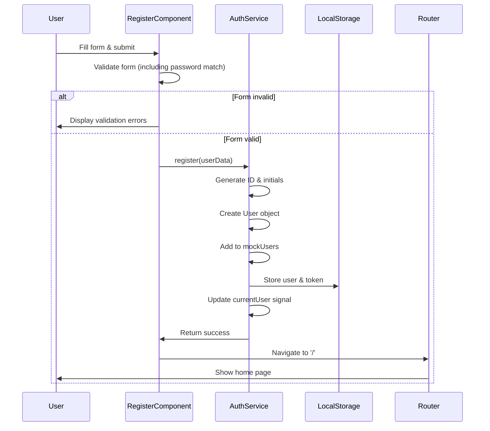
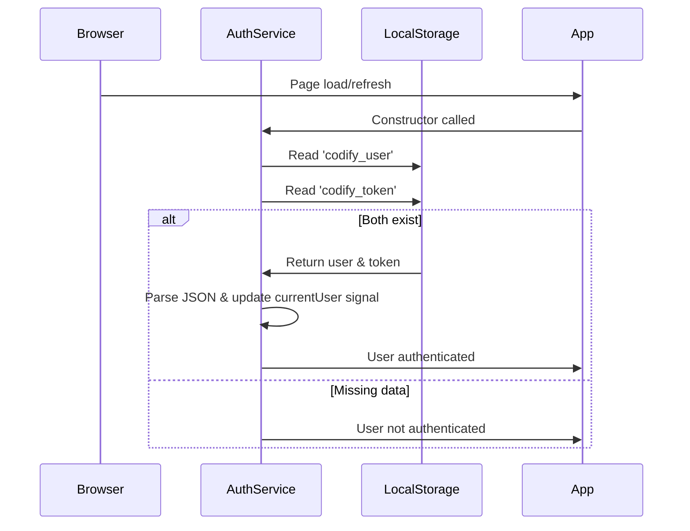
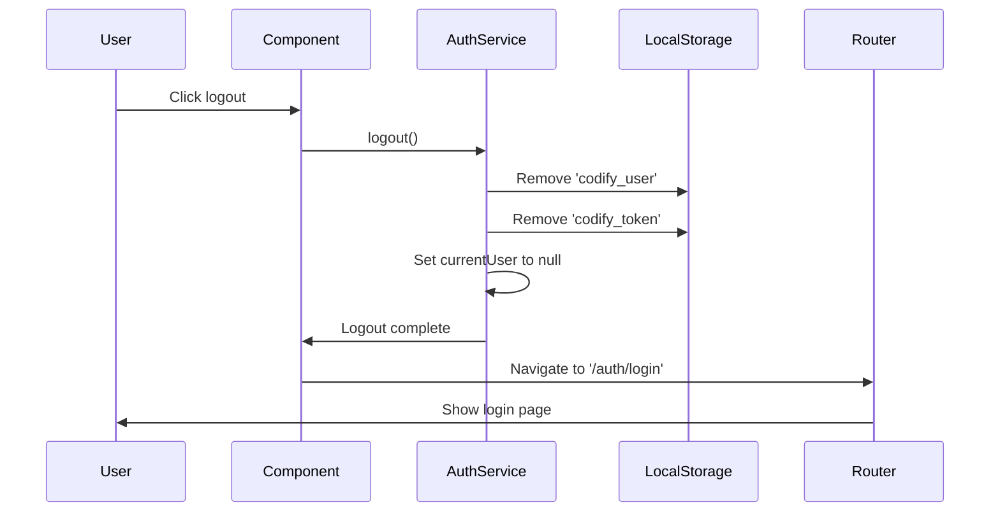

# Design Document: Authentication System

## Overview

The authentication system provides login, registration, and password recovery functionality for Codify, an Angular 19-based programming education platform. The system supports two user roles (Student and Instructor) and uses mock data with localStorage for session persistence.

### Key Design Decisions

1. **Mock-First Approach**: The system uses hardcoded user data and localStorage instead of backend APIs, enabling frontend development without backend dependencies.

2. **Signal-Based State Management**: Leverages Angular 19's signal primitives for reactive authentication state, providing automatic change detection and computed values.

3. **Reactive Forms**: Uses Angular Reactive Forms for type-safe form management, validation, and error handling.

4. **Lazy Loading**: Authentication routes are lazy-loaded to optimize initial bundle size.

5. **Session Persistence**: User sessions persist across browser refreshes using localStorage, providing a seamless user experience.

### Architecture Diagram



## Architecture

### Component Structure

The authentication system follows Angular's feature-based architecture with three main components:

```
src/app/features/auth/
├── auth.routes.ts                    # Route definitions
├── login/
│   ├── login.component.ts            # Component logic
│   ├── login.component.html          # Template
│   └── login.component.scss          # Styles
├── register/
│   ├── register.component.ts
│   ├── register.component.html
│   └── register.component.scss
└── forgot-password/
    ├── forgot-password.component.ts
    ├── forgot-password.component.html
    └── forgot-password.component.scss
```

### Service Architecture

The `AuthService` is a singleton service provided at root level, managing:
- Authentication state via Angular signals
- Mock user data validation
- localStorage persistence
- Session restoration on app initialization

### Routing Architecture

Routes are defined in `auth.routes.ts` and lazy-loaded from the main application routes:

```typescript
// Main routes (app.routes.ts)
{ path: 'auth', loadChildren: () => import('./features/auth/auth.routes') }

// Auth routes (auth.routes.ts)
/auth/login          → LoginComponent
/auth/register       → RegisterComponent
/auth/forgot-password → ForgotPasswordComponent
```

An `AuthGuard` protects authenticated routes and redirects logged-in users away from auth pages.

## Components and Interfaces

### LoginComponent

**Responsibility**: Render login form, validate input, authenticate users, and navigate on success.

**Template Structure**:
```html
<div class="auth-container">
  <div class="auth-card">
    <h1>Welcome Back</h1>
    <form [formGroup]="loginForm" (ngSubmit)="onSubmit()">
      <!-- Email input with validation -->
      <!-- Password input with visibility toggle -->
      <!-- Remember me checkbox -->
      <!-- Submit button -->
      <!-- Error message display -->
      <!-- Links to register and forgot password -->
    </form>
  </div>
</div>
```

**Form Structure**:
```typescript
loginForm = FormGroup({
  email: FormControl<string>('', [Validators.required, Validators.email]),
  password: FormControl<string>('', [Validators.required]),
  rememberMe: FormControl<boolean>(false)
})
```

**Key Methods**:
- `onSubmit()`: Validates form and calls `authService.login()`
- `togglePasswordVisibility()`: Switches password field type
- `getErrorMessage(field: string)`: Returns validation error text

**Dependencies**:
- `AuthService` (injected)
- `Router` (injected)
- `ReactiveFormsModule` (imported)
- `CommonModule` (imported)

### RegisterComponent

**Responsibility**: Render registration form, validate input including password matching, create new users, and navigate on success.

**Template Structure**:
```html
<div class="auth-container">
  <div class="auth-card">
    <h1>Create Your Account</h1>
    <form [formGroup]="registerForm" (ngSubmit)="onSubmit()">
      <!-- Full name input -->
      <!-- Email input with validation -->
      <!-- Password input with visibility toggle -->
      <!-- Confirm password input with matching validation -->
      <!-- Role selector (Student/Instructor) -->
      <!-- Submit button -->
      <!-- Link to login -->
    </form>
  </div>
</div>
```

**Form Structure**:
```typescript
registerForm = FormGroup({
  fullName: FormControl<string>('', [Validators.required]),
  email: FormControl<string>('', [Validators.required, Validators.email]),
  password: FormControl<string>('', [Validators.required]),
  confirmPassword: FormControl<string>('', [Validators.required]),
  role: FormControl<'student' | 'instructor' | ''>('', [Validators.required])
}, { validators: passwordMatchValidator })
```

**Custom Validators**:
- `passwordMatchValidator`: Cross-field validator ensuring password and confirmPassword match

**Key Methods**:
- `onSubmit()`: Validates form and calls `authService.register()`
- `togglePasswordVisibility(field: 'password' | 'confirmPassword')`: Switches field type
- `getErrorMessage(field: string)`: Returns validation error text

**Dependencies**:
- `AuthService` (injected)
- `Router` (injected)
- `ReactiveFormsModule` (imported)
- `CommonModule` (imported)

### ForgotPasswordComponent

**Responsibility**: Display password recovery interface with email input and success state.

**Template Structure**:
```html
<div class="auth-container">
  <div class="auth-card">
    @if (!submitted) {
      <h1>Reset Password</h1>
      <form [formGroup]="forgotForm" (ngSubmit)="onSubmit()">
        <!-- Email input -->
        <!-- Submit button -->
      </form>
    } @else {
      <h1>Check Your Email</h1>
      <p>If this email exists, a reset link has been sent.</p>
      <a routerLink="/auth/login">Back to Login</a>
    }
  </div>
</div>
```

**Form Structure**:
```typescript
forgotForm = FormGroup({
  email: FormControl<string>('', [Validators.required, Validators.email])
})
```

**State Management**:
- `submitted: boolean`: Tracks whether form has been submitted to show success screen

**Key Methods**:
- `onSubmit()`: Sets `submitted = true` (no actual email sending)

**Dependencies**:
- `ReactiveFormsModule` (imported)
- `CommonModule` (imported)
- `RouterModule` (imported)

### AuthService

**Responsibility**: Manage authentication state, validate credentials against mock data, persist sessions, and expose reactive authentication state.

**Interface**:
```typescript
interface AuthService {
  // Signals
  currentUser: Signal<User | null>
  isLoggedIn: Signal<boolean>
  
  // Methods
  login(email: string, password: string): Observable<AuthResult>
  register(userData: RegisterData): Observable<AuthResult>
  logout(): void
  restoreSession(): void
}

interface AuthResult {
  success: boolean
  error?: string
}

interface RegisterData {
  fullName: string
  email: string
  password: string
  role: 'student' | 'instructor'
}
```

**Mock Data**:
```typescript
private mockUsers: User[] = [
  {
    id: '1',
    name: 'Test Student',
    email: 'student@codify.com',
    password: '123456',
    role: 'student',
    avatarInitials: 'TS',
    streak: 0
  },
  {
    id: '2',
    name: 'Test Instructor',
    email: 'instructor@codify.com',
    password: '123456',
    role: 'instructor',
    avatarInitials: 'TI'
  }
]
```

**State Management**:
- `_currentUser = signal<User | null>(null)`: Private writable signal
- `currentUser = this._currentUser.asReadonly()`: Public readonly signal
- `isLoggedIn = computed(() => this._currentUser() !== null)`: Computed signal

**Key Methods**:

1. `login(email: string, password: string): Observable<AuthResult>`
   - Searches mockUsers for matching email and password
   - On success: generates mock token, stores user and token in localStorage, updates currentUser signal
   - On failure: returns error result
   - Returns Observable for async handling

2. `register(userData: RegisterData): Observable<AuthResult>`
   - Generates unique ID (e.g., `Date.now().toString()`)
   - Generates avatarInitials from fullName (first letter of first and last name)
   - Creates User object with provided data
   - Adds user to mockUsers array
   - Stores user and token in localStorage
   - Updates currentUser signal
   - Returns success result

3. `logout(): void`
   - Removes 'codify_user' from localStorage
   - Removes 'codify_token' from localStorage
   - Sets currentUser signal to null

4. `restoreSession(): void` (called in constructor)
   - Reads 'codify_user' and 'codify_token' from localStorage
   - If both exist, parses user JSON and updates currentUser signal
   - Enables session persistence across page refreshes

**LocalStorage Keys**:
- `codify_user`: JSON-stringified User object
- `codify_token`: Mock token string (e.g., `'mock-token-' + Date.now()`)

### AuthGuard

**Responsibility**: Protect routes that require authentication and redirect authenticated users away from auth pages.

**Interface**:
```typescript
export const authGuard: CanActivateFn = (route, state) => {
  const authService = inject(AuthService);
  const router = inject(Router);
  
  if (authService.isLoggedIn()) {
    return true;
  }
  
  router.navigate(['/auth/login']);
  return false;
};

export const guestGuard: CanActivateFn = (route, state) => {
  const authService = inject(AuthService);
  const router = inject(Router);
  
  if (!authService.isLoggedIn()) {
    return true;
  }
  
  router.navigate(['/']);
  return false;
};
```

**Usage**:
- `authGuard`: Applied to protected routes (e.g., /dashboard)
- `guestGuard`: Applied to auth routes (e.g., /auth/login, /auth/register)

## Data Models

### User Model

```typescript
export interface User {
  id: string;
  name: string;
  email: string;
  role: 'student' | 'instructor';
  avatarInitials: string;
  streak?: number;
  password?: string; // Only used in mock data, never exposed to components
}
```

**Field Descriptions**:
- `id`: Unique identifier (generated as `Date.now().toString()` for new users)
- `name`: Full name of the user
- `email`: Email address (used for login)
- `role`: User type, either 'student' or 'instructor'
- `avatarInitials`: Two-letter initials for avatar display (e.g., "TS" for "Test Student")
- `streak`: Optional field tracking consecutive days of activity (used for students)
- `password`: Only present in mock data for validation, stripped before storing in localStorage

### Form Data Models

```typescript
export interface LoginFormData {
  email: string;
  password: string;
  rememberMe: boolean;
}

export interface RegisterFormData {
  fullName: string;
  email: string;
  password: string;
  confirmPassword: string;
  role: 'student' | 'instructor' | '';
}

export interface ForgotPasswordFormData {
  email: string;
}
```

### Authentication Result Model

```typescript
export interface AuthResult {
  success: boolean;
  error?: string;
  user?: User;
}
```

## Data Flow

### Login Flow



### Registration Flow



### Session Restoration Flow



### Logout Flow



## Styling Approach

### Design System Integration

All authentication components use the existing Codify design tokens from `src/app/styles/_variables.scss`:

**Colors**:
- Primary headings: `$navy` (#1A2B4A)
- Primary buttons: `$blue` (#2E86AB)
- Button hover: Darken `$blue` by 10%
- Body text: `$charcoal` (#444441)
- Secondary text/labels: `$muted` (#6B6B68)
- Background: `$ivory` (#F5F3EE)
- Card background: `$white` (#FFFFFF)
- Error text: `#D32F2F` (Material Design red)
- Success text: `$teal` (#1D9E75)

**Typography**:
- All text: `$ff-body` (DM Sans)
- Headings: 24px-32px, weight 600
- Body text: 16px, weight 400
- Labels: 14px, weight 500
- Error messages: 12px, weight 400

**Spacing**:
- Card padding: 40px
- Input spacing: 20px between fields
- Button height: 48px
- Input height: 44px

**Borders & Shadows**:
- Card border-radius: `$r-lg` (16px)
- Input border-radius: `$r` (10px)
- Card shadow: `$shadow` (0 2px 24px rgba(26, 43, 74, 0.10))
- Input border: 1px solid `$border` (rgba(26, 43, 74, 0.12))
- Focus border: 2px solid `$blue`

### Layout Structure

**Centered Card Layout**:
```scss
.auth-container {
  min-height: 100vh;
  display: flex;
  align-items: center;
  justify-content: center;
  background-color: $ivory;
  padding: 20px;
}

.auth-card {
  background: $white;
  border-radius: $r-lg;
  box-shadow: $shadow;
  padding: 40px;
  width: 100%;
  max-width: 440px;
}
```

### Form Input Styling

```scss
.form-field {
  margin-bottom: 20px;
  
  label {
    display: block;
    font-size: 14px;
    font-weight: 500;
    color: $charcoal;
    margin-bottom: 8px;
  }
  
  input, select {
    width: 100%;
    height: 44px;
    padding: 0 16px;
    border: 1px solid $border;
    border-radius: $r;
    font-family: $ff-body;
    font-size: 16px;
    color: $charcoal;
    transition: border-color 0.2s;
    
    &:focus {
      outline: none;
      border: 2px solid $blue;
      padding: 0 15px; // Adjust for thicker border
    }
    
    &.error {
      border-color: #D32F2F;
    }
  }
}

.error-message {
  font-size: 12px;
  color: #D32F2F;
  margin-top: 4px;
}
```

### Button Styling

```scss
.btn-primary {
  width: 100%;
  height: 48px;
  background-color: $blue;
  color: $white;
  border: none;
  border-radius: $r;
  font-family: $ff-body;
  font-size: 16px;
  font-weight: 600;
  cursor: pointer;
  transition: background-color 0.2s;
  
  &:hover:not(:disabled) {
    background-color: darken($blue, 10%);
  }
  
  &:disabled {
    opacity: 0.5;
    cursor: not-allowed;
  }
}
```

### Password Toggle Styling

```scss
.password-field {
  position: relative;
  
  input {
    padding-right: 48px; // Space for icon
  }
  
  .toggle-icon {
    position: absolute;
    right: 16px;
    top: 50%;
    transform: translateY(-50%);
    cursor: pointer;
    color: $muted;
    
    &:hover {
      color: $charcoal;
    }
  }
}
```

### Responsive Design

```scss
@media (max-width: 480px) {
  .auth-card {
    padding: 24px;
  }
  
  h1 {
    font-size: 24px;
  }
}
```


## Correctness Properties

*A property is a characteristic or behavior that should hold true across all valid executions of a system—essentially, a formal statement about what the system should do. Properties serve as the bridge between human-readable specifications and machine-verifiable correctness guarantees.*

### Property Reflection

After analyzing all acceptance criteria, I identified the following redundancies:
- Multiple criteria about localStorage operations (4.5, 4.6, 4.14, 4.15, 7.1, 7.2) can be consolidated into comprehensive storage properties
- Password toggle behavior (1.3, 2.4, 10.4, 10.5) can be combined into a single bidirectional toggle property
- Navigation after authentication (1.12, 2.16, 5.4, 5.5) can be consolidated
- Session restoration criteria (4.23, 4.24, 7.3, 7.4, 7.5) can be combined into a single restoration property
- Logout cleanup (4.18, 4.19, 7.6) can be combined into a single cleanup property
- Form validation error display (1.14, 2.17) can be generalized into a single property
- Guard redirect behavior (5.6, 5.7) can be combined into a single property

The following properties represent the unique, non-redundant validation requirements:

### Property 1: Password Visibility Toggle

*For any* password input field with a visibility toggle, clicking the toggle should switch the field type between "password" and "text", and clicking again should switch it back to the original type.

**Validates: Requirements 1.3, 2.4, 10.4, 10.5**

### Property 2: Email Field Validation

*For any* email input field, when the field is empty or contains an invalid email format, the form should display the appropriate validation error message.

**Validates: Requirements 1.9, 2.11, 6.1, 6.2**

### Property 3: Required Field Validation

*For any* required input field (password, full name, role), when the field is empty or unselected, the form should display the appropriate "required" validation error message.

**Validates: Requirements 1.10, 2.10, 2.12, 2.14, 6.3, 6.4, 6.6**

### Property 4: Password Match Validation

*For any* registration form, when the password and confirm password fields contain different values, the form should display the error message "Passwords do not match".

**Validates: Requirements 2.13, 6.5**

### Property 5: Form Validation Error Display

*For any* form with validation errors, each invalid field should display its corresponding inline error message.

**Validates: Requirements 1.14, 2.17**

### Property 6: Submit Button Disabled State

*For any* authentication form, when validation errors exist, the submit button should be disabled.

**Validates: Requirements 6.8**

### Property 7: Login Service Integration

*For any* valid login form submission, the component should call AuthService.login() with the provided email and password.

**Validates: Requirements 1.11**

### Property 8: Registration Service Integration

*For any* valid registration form submission, the component should call AuthService.register() with the complete user data including fullName, email, password, and role.

**Validates: Requirements 2.15, 9.2**

### Property 9: Successful Authentication Navigation

*For any* successful authentication (login or registration), the system should navigate to route '/'.

**Validates: Requirements 1.12, 2.16, 5.4, 5.5**

### Property 10: Failed Login Error Display

*For any* failed login attempt, the component should display the error message "Invalid email or password".

**Validates: Requirements 1.13**

### Property 11: Forgot Password State Transition

*For any* email input in the forgot password form, clicking "Send Reset Link" should transition the component to the success screen.

**Validates: Requirements 3.3**

### Property 12: No Backend Requests in Forgot Password

*For any* forgot password submission, the system should not make HTTP requests or send actual emails.

**Validates: Requirements 3.6**

### Property 13: Login Credential Validation

*For any* email and password combination, AuthService.login() should return success if and only if the credentials match a user in the mock user list.

**Validates: Requirements 4.3, 4.8, 4.9**

### Property 14: Authentication Session Storage

*For any* successful authentication (login or registration), the AuthService should store both the user object (as JSON with key 'codify_user') and a token (with key 'codify_token') in localStorage.

**Validates: Requirements 4.5, 4.6, 4.14, 4.15, 7.1, 7.2**

### Property 15: Authentication Signal Update

*For any* successful authentication (login or registration), the AuthService should update the currentUser signal with the authenticated user object.

**Validates: Requirements 4.7, 4.16**

### Property 16: User Registration Creation

*For any* registration request, the AuthService should create a new user with a unique ID, generated avatarInitials from the name, and add it to the mock user list.

**Validates: Requirements 4.11, 4.12, 4.13**

### Property 17: Avatar Initials Generation

*For any* full name string, the AuthService should generate avatarInitials by extracting the first letter of the first word and the first letter of the last word (or first two letters if only one word).

**Validates: Requirements 4.13**

### Property 18: Logout Cleanup

*For any* logout operation, the AuthService should remove both 'codify_user' and 'codify_token' from localStorage and set the currentUser signal to null.

**Validates: Requirements 4.18, 4.19, 4.20, 7.6**

### Property 19: IsLoggedIn Computed Signal

*For any* currentUser signal state, the isLoggedIn computed signal should return true when currentUser is not null, and false when currentUser is null.

**Validates: Requirements 4.22**

### Property 20: Session Restoration

*For any* application initialization, if both 'codify_user' and 'codify_token' exist in localStorage, the AuthService should restore the user session by setting the currentUser signal to the stored user object.

**Validates: Requirements 4.23, 4.24, 7.3, 7.4, 7.5**

### Property 21: Authenticated User Guard Redirect

*For any* authenticated user attempting to navigate to /auth/login or /auth/register, the system should redirect to route '/'.

**Validates: Requirements 5.6, 5.7**

### Property 22: Role Persistence

*For any* authenticated user, the role property should be included in the stored user object and accessible through the currentUser signal.

**Validates: Requirements 9.3, 9.4**

### Property 23: Password Toggle Icon Display

*For any* password field with type "password", the toggle control should display a "show" icon, and when the type is "text", it should display a "hide" icon.

**Validates: Requirements 10.2, 10.3**

## Error Handling

### Form Validation Errors

**Strategy**: Use Angular Reactive Forms validators to catch errors at the form level before submission.

**Error Types**:
1. **Required Field Errors**: Display when user leaves a required field empty
   - Email: "Email is required"
   - Password: "Password is required"
   - Full Name: "Full name is required"
   - Role: "Please select a role"

2. **Format Validation Errors**: Display when input doesn't match expected format
   - Email: "Please enter a valid email address"

3. **Cross-Field Validation Errors**: Display when related fields don't match
   - Confirm Password: "Passwords do not match"

**Error Display**:
- Errors appear inline below the relevant input field
- Errors display in red (#D32F2F)
- Errors appear after field loses focus (blur event)
- Submit button is disabled while errors exist

### Authentication Errors

**Strategy**: Handle authentication failures gracefully with user-friendly messages.

**Error Types**:
1. **Invalid Credentials**: When email/password don't match mock user list
   - Display: "Invalid email or password"
   - Location: Below submit button in login form
   - Action: Allow user to retry

2. **Missing Session Data**: When localStorage is corrupted or incomplete
   - Action: Treat as logged out, clear any partial data
   - No user-facing error (silent recovery)

### LocalStorage Errors

**Strategy**: Gracefully handle localStorage access failures (quota exceeded, disabled, etc.)

**Error Handling**:
```typescript
try {
  localStorage.setItem('codify_user', JSON.stringify(user));
  localStorage.setItem('codify_token', token);
} catch (error) {
  console.error('Failed to persist session:', error);
  // Continue with in-memory session only
  // User will need to re-login on refresh
}
```

**Recovery**:
- If localStorage write fails, authentication still succeeds in-memory
- User remains logged in for current session
- Session won't persist across page refreshes
- No error message shown to user (degraded functionality is acceptable)

### JSON Parsing Errors

**Strategy**: Handle corrupted localStorage data gracefully.

**Error Handling**:
```typescript
try {
  const userJson = localStorage.getItem('codify_user');
  const user = userJson ? JSON.parse(userJson) : null;
  if (user && this.isValidUser(user)) {
    this._currentUser.set(user);
  } else {
    this.clearSession();
  }
} catch (error) {
  console.error('Failed to parse stored user:', error);
  this.clearSession();
}
```

**Recovery**:
- Clear corrupted session data
- Treat user as logged out
- Redirect to login page if on protected route

### Navigation Errors

**Strategy**: Ensure navigation failures don't break the application.

**Error Handling**:
```typescript
this.router.navigate(['/']).catch(error => {
  console.error('Navigation failed:', error);
  // Fallback: try navigating to login
  this.router.navigate(['/auth/login']);
});
```

## Testing Strategy

### Dual Testing Approach

The authentication system requires both unit tests and property-based tests for comprehensive coverage:

**Unit Tests**: Focus on specific examples, edge cases, and integration points
- Component rendering and UI element presence
- Specific user interactions (button clicks, form submissions)
- Route configuration and guard behavior
- Mock service responses
- Edge cases (empty strings, special characters, boundary values)

**Property-Based Tests**: Focus on universal properties across all inputs
- Form validation logic with randomly generated inputs
- Authentication logic with various credential combinations
- Session persistence with different user data
- Signal state management with various state transitions
- Password toggle behavior with random initial states

### Property-Based Testing Configuration

**Library**: Use `fast-check` for TypeScript/Angular property-based testing

**Installation**:
```bash
npm install --save-dev fast-check
```

**Configuration**:
- Minimum 100 iterations per property test
- Each test references its design document property
- Tag format: `// Feature: authentication-system, Property {number}: {property_text}`

**Example Property Test Structure**:
```typescript
import fc from 'fast-check';

describe('AuthService Properties', () => {
  it('Property 13: Login Credential Validation', () => {
    // Feature: authentication-system, Property 13: Login credential validation
    fc.assert(
      fc.property(
        fc.emailAddress(),
        fc.string({ minLength: 6 }),
        (email, password) => {
          const result = authService.login(email, password);
          const isInMockList = mockUsers.some(
            u => u.email === email && u.password === password
          );
          expect(result.success).toBe(isInMockList);
        }
      ),
      { numRuns: 100 }
    );
  });
});
```

### Unit Test Coverage

**LoginComponent**:
- Renders email input with type="email"
- Renders password input with type="password"
- Renders remember me checkbox
- Renders login button
- Renders links to register and forgot password
- Displays validation errors on invalid input
- Calls AuthService.login() on valid submission
- Navigates to '/' on successful login
- Displays error message on failed login

**RegisterComponent**:
- Renders all required input fields
- Renders role selector with Student and Instructor options
- Displays validation errors on invalid input
- Validates password matching
- Calls AuthService.register() on valid submission
- Navigates to '/' on successful registration

**ForgotPasswordComponent**:
- Renders email input on initial screen
- Renders "Send Reset Link" button
- Transitions to success screen on submission
- Displays success message and login link
- Does not make HTTP requests

**AuthService**:
- Initializes with two mock users
- Validates credentials against mock list
- Stores user and token in localStorage on success
- Updates currentUser signal on success
- Returns error on invalid credentials
- Generates unique IDs for new users
- Generates correct avatarInitials
- Adds new users to mock list
- Clears localStorage on logout
- Restores session from localStorage on init
- Handles corrupted localStorage data

**AuthGuard**:
- Allows authenticated users to access protected routes
- Redirects unauthenticated users to /auth/login
- Redirects authenticated users away from auth routes

### Property Test Coverage

Each of the 23 correctness properties should have a corresponding property-based test:

1. **Property 1**: Password toggle switches type bidirectionally
2. **Property 2**: Email validation catches empty and invalid formats
3. **Property 3**: Required field validation catches empty values
4. **Property 4**: Password match validation catches mismatches
5. **Property 5**: All invalid fields display errors
6. **Property 6**: Submit button disabled when errors exist
7. **Property 7**: Login calls service with correct parameters
8. **Property 8**: Registration calls service with complete data
9. **Property 9**: Successful auth navigates to home
10. **Property 10**: Failed login displays error
11. **Property 11**: Forgot password transitions to success
12. **Property 12**: Forgot password makes no HTTP requests
13. **Property 13**: Login validates credentials correctly
14. **Property 14**: Auth stores user and token in localStorage
15. **Property 15**: Auth updates currentUser signal
16. **Property 16**: Registration creates user with ID and initials
17. **Property 17**: Avatar initials extracted correctly from names
18. **Property 18**: Logout clears storage and signal
19. **Property 19**: isLoggedIn reflects currentUser state
20. **Property 20**: Session restored from localStorage
21. **Property 21**: Guards redirect authenticated users
22. **Property 22**: Role persisted and accessible
23. **Property 23**: Toggle icon reflects password field type

### Test Data Generators

For property-based tests, use these generators:

```typescript
// Email generator
const emailArb = fc.emailAddress();

// Password generator (6+ characters)
const passwordArb = fc.string({ minLength: 6, maxLength: 20 });

// Name generator
const nameArb = fc.string({ minLength: 1, maxLength: 50 })
  .filter(s => s.trim().length > 0);

// Role generator
const roleArb = fc.constantFrom('student', 'instructor');

// User generator
const userArb = fc.record({
  id: fc.string(),
  name: nameArb,
  email: emailArb,
  role: roleArb,
  avatarInitials: fc.string({ minLength: 2, maxLength: 2 }),
  password: passwordArb
});

// Invalid email generator
const invalidEmailArb = fc.string()
  .filter(s => !s.includes('@') || !s.includes('.'));
```

### Integration Testing

**Router Integration**:
- Test lazy loading of auth routes
- Test navigation between auth pages
- Test guard behavior with real router
- Test navigation after authentication

**Service-Component Integration**:
- Test component response to service success/failure
- Test signal updates propagating to component templates
- Test localStorage persistence across component lifecycle

### Manual Testing Checklist

- [ ] Login with valid student credentials
- [ ] Login with valid instructor credentials
- [ ] Login with invalid credentials
- [ ] Register new student account
- [ ] Register new instructor account
- [ ] Toggle password visibility in login
- [ ] Toggle password visibility in register (both fields)
- [ ] Submit forms with validation errors
- [ ] Use "Remember me" checkbox
- [ ] Navigate between auth pages using links
- [ ] Refresh page while logged in (session persists)
- [ ] Logout and verify session cleared
- [ ] Access protected route while logged out (redirects to login)
- [ ] Access auth routes while logged in (redirects to home)
- [ ] Submit forgot password form
- [ ] Verify responsive design on mobile
- [ ] Verify styling matches design system

