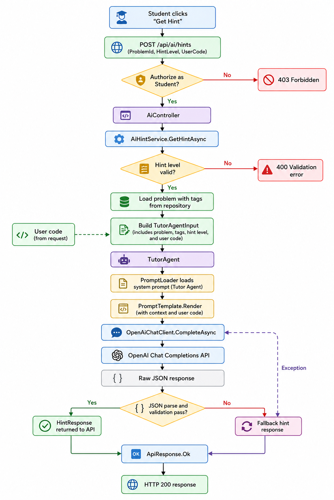

# Codify — AI Flow Diagram

This document describes the AI hint pipeline that is currently implemented in code. The active runtime path is the tutor hint flow wired through `AiController`, `AiHintService`, `TutorAgent`, and `OpenAiChatClient`.

## Current Flow

```text
Student clicks Get Hint
  -> POST /api/ai/hints
  -> AiController
  -> AiHintService.GetHintAsync
  -> validate hint level
      -> invalid: 400 Validation error
  -> load problem with tags from repository
  -> build TutorAgentInput
  -> TutorAgent
  -> PromptLoader loads tutor-agent-system.txt
  -> PromptTemplate.Render
  -> OpenAiChatClient.CompleteAsync
  -> OpenAI Chat Completions API
  -> raw JSON response
  -> parse and validate response
      -> valid: HintResponse returned to API
      -> invalid or exception: fallback hint response
  -> ApiResponse.Ok
  -> HTTP 200 response
```

## Inputs To The Model

The current request body is [HintRequest](../../backend/src/Codify.Application/DTOs/AI/HintRequest.cs):

- `ProblemId`
- `StudentCode`
- `HintLevel` from 1 to 3
- `PreviousHints` as a list of prior hints
- `AttemptCount`
- `LastSubmissionStatus`

`AiHintService` converts that request into [TutorAgentInput](../../backend/src/Codify.Application/Agents/TutorAgentInput.cs).

## Prompt Construction

The tutor agent loads the prompt template from [tutor-agent-system.txt](../../backend/src/Codify.Infrastructure/AI/Prompts/tutor-agent-system.txt) and replaces placeholders for:

- problem title
- problem statement
- concept tags
- retrieved context
- hint level
- previous hints
- attempt count

At the moment, `RetrievedContext` is empty because no RAG retriever is wired into the runtime path yet.

## Model Interaction And Guard Rails

The prompt instructs the model to:

- never write the full solution
- give one hint at a time
- ask a follow-up question
- keep the answer concise
- return valid JSON only

After the model responds, `TutorAgent`:

1. Parses the JSON payload into `HintResponse`.
2. Rejects empty or structurally invalid responses.
3. Falls back to a safe default hint when parsing fails or the call throws.

## Fallback Behavior

The fallback response is a short generic hint that nudges the student back to the problem constraints. The current implementation does not persist hint history to `HintLog` yet, so the model cannot be grounded in prior hint history from the database.

## Known Gaps

- No vector retrieval step is active yet.
- No hint-history persistence is active yet.
- No secondary code-checker or analytics agent is wired into runtime.
- `HintsController` is a placeholder route that overlaps with the active controller route and should be treated as a temporary leftover.

