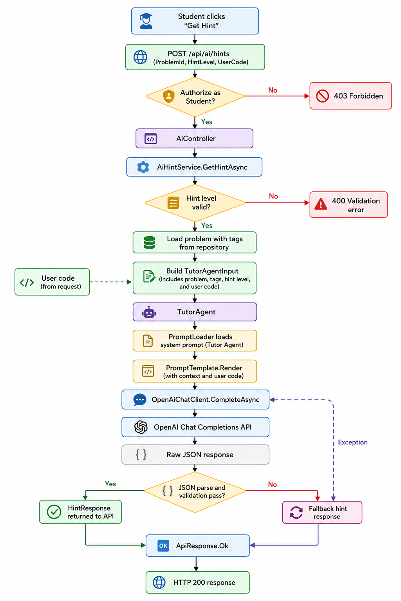

# Codify — AI Flow Diagram

This document describes the AI hint pipeline that is currently implemented in code. The active runtime path is the **agentic** tutor hint flow wired through AiController, AiHintService, TutorAgentService, TutorAgentTools, and OpenAiChatClient.

## Current Flow

`	ext
Student clicks Get Hint
  -> POST /api/ai/hints
  -> AiController
  -> AiHintService.GetHintAsync
  -> validate hint level (treated as a suggestion)
      -> invalid: 400 Validation error
  -> load problem with tags from repository
  -> build TutorAgentInput (now includes UserId)
  -> TutorAgentService.GenerateHintAsync
       -> PromptLoader loads tutor-agent-system.txt
       -> OpenAiChatClient.CompleteWithToolsAsync
       -> OpenAI Chat Completions API with 4 tool definitions
       -> model may return tool_calls
            -> TutorAgentTools executes get_attempt_history /
               search_knowledge_base / check_partial_code / get_previous_hints
            -> append tool results to conversation
            -> resend to OpenAI (loop, max 5 iterations)
       -> model returns final JSON response
       -> parse and validate response
            -> valid: HintResponse returned to API
            -> invalid, exception, or iteration cap: fallback hint response
  -> persist HintLog with tools_used + reasoning_summary
  -> ApiResponse.Ok
  -> HTTP 200 response
`

## Inputs To The Model

The current request body is [HintRequest](../../backend/src/Codify.Application/DTOs/AI/HintRequest.cs):

- ProblemId
- StudentCode
- HintLevel from 1 to 3 (suggested by client; agent determines actual level)
- PreviousHints as a list of prior hints
- AttemptCount
- LastSubmissionStatus

AiHintService converts that request into [TutorAgentInput](../../backend/src/Codify.Application/Agents/TutorAgentInput.cs), which now also carries UserId so the agent can look up real attempt history and previous hints.

## Tool Definitions

The agent receives four OpenAI function-calling tools defined in [TutorAgentToolSchemas.cs](../../backend/src/Codify.Infrastructure/AI/TutorAgentToolSchemas.cs):

1. get_attempt_history(studentId, problemId) — real submission statuses and previous hint levels.
2. search_knowledge_base(query, conceptTag?) — concept-doc retrieval from ConceptTag descriptions.
3. check_partial_code(code, language) — lightweight structural observations.
4. get_previous_hints(studentId, problemId) — exact text of prior hints for this problem.

The **model** decides which tools to call, in what order, and how many. The C# code does not contain if/else logic that predetermines tool selection.

## Prompt Construction

The tutor agent loads the system prompt from [tutor-agent-system.txt](../../backend/src/Codify.Infrastructure/AI/Prompts/tutor-agent-system.txt). It tells the model:

- it may call zero, one, or multiple tools before responding
- to use get_attempt_history to judge how stuck the student is
- to use search_knowledge_base for missing concepts
- to use check_partial_code when the student supplied code
- to use get_previous_hints to avoid repetition
- to never reveal a full solution
- to return structured JSON with hint_text, hint_level, 	ools_used, 
easoning_summary, and ollow_up_available

## Model Interaction And Guard Rails

The prompt instructs the model to:

- never write the full solution
- prefer guiding questions and conceptual nudges
- escalate specificity gradually based on history
- ground concept explanations in retrieved knowledge-base content
- return valid JSON only

After the loop, TutorAgentService:

1. Parses the JSON payload into HintResponse.
2. Clamps hintLevel to the 1–3 range.
3. Rejects empty or structurally invalid responses.
4. Falls back to a safe default hint when parsing fails, the call throws, or the 5-iteration cap is hit.

## Fallback Behavior

The fallback response is a short generic hint that nudges the student back to the problem constraints. It still includes 	oolsUsed (whatever the agent managed to call before failing) and a 
easoningSummary explaining the fallback.

## Persistence

AiHintService persists every hint to HintLog with:

- HintLevel (agent's own assessment)
- RequestText
- ResponseText
- ToolsUsedJson
- ReasoningSummary
- CreatedAt

This closes the previously documented gap and provides auditable evidence of the agent's tool-use decisions.

## Known Gaps

- No secondary code-checker or analytics agent is wired into runtime.
- HintsController is a placeholder route that overlaps with the active controller route and should be treated as a temporary leftover.

