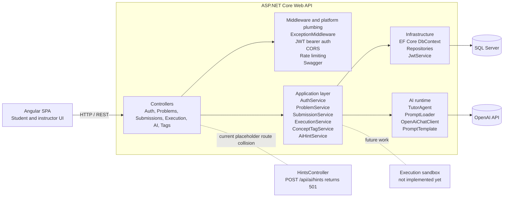

# Codify — System Architecture

Codify is currently implemented as a modular monolith: one ASP.NET Core Web API host owns HTTP, auth, business logic orchestration, persistence, and the active AI hint flow. The frontend is an Angular SPA that talks to the API over JSON/REST.

## High-Level Diagram

## Current Modules

### API Host
The API host is the composition root in [Program.cs](../../backend/src/Codify.API/Program.cs). It wires infrastructure, JWT authentication, authorization, rate limiting, CORS for the Angular dev server, Swagger, and startup database seeding.

### Application Layer
The application layer owns use cases and DTO mapping. The current services are:

- `AuthService` for register, login, and current-user lookup
- `ProblemService` for problem browse, create, update, delete, and detail projection
- `SubmissionService` for submission creation and retrieval
- `ExecutionService` for the current sample-case run stub
- `ConceptTagService` for concept tag CRUD and problem-tag linking
- `AiHintService` for hint orchestration

### Domain Layer
The domain layer contains the stateful entities and business rules:

- `User`
- `Problem`
- `ConceptTag`
- `ProblemTag`
- `TestCase`
- `Submission`
- `SubmissionResult`
- `HintLog`
- `PerformanceProfile`
- `FeedbackRecord`

### Infrastructure Layer
Infrastructure provides SQL Server EF Core persistence, repository implementations, JWT issuance, and the OpenAI adapter used by the tutor agent.

## Current Runtime Flows

### Authentication
1. The client calls `/api/auth/register` or `/api/auth/login`.
2. `AuthService` hashes or verifies passwords with BCrypt.
3. `JwtService` issues a bearer token containing user id, email, and role.
4. The API validates the token on every protected request.

### Problem Browsing and Submission
1. Students call `/api/problems` and `/api/problems/{id}` to browse problems.
2. Students submit code through `/api/submissions`.
3. `SubmissionService` creates a `Submission` record in `Pending` state.
4. `ExecutionService` currently returns a stubbed sample-case response for the run flow; a real sandbox is still pending.

### AI Hint Flow
1. The client calls `/api/ai/hints`.
2. `AiHintService` validates the hint level and loads the problem with tags.
3. `TutorAgent` loads the prompt template and renders it with the problem context.
4. `OpenAiChatClient` sends the request to OpenAI.
5. The agent parses the JSON response and falls back to a safe generic hint if the model call fails or returns invalid JSON.

## Key Implementation Notes

- The runtime database provider is SQL Server, not PostgreSQL.
- The active AI path is a single tutor-agent flow. RAG retrieval, analytics agents, and code-checker agents are not wired into runtime yet.
- `HintsController` still exists as a placeholder and maps the same route as the active AI controller. That should be treated as a temporary mismatch, not a second production hint implementation.
- The current execution path is a stub that echoes sample test cases; the dedicated sandbox is not implemented in code yet.

## Cross-References

- [API documentation](../api/API_SPEC.md)
- [AI flow diagram](./AI_FLOW.md)
- [Data model](../database/DATA_MODEL.md)
- [ER diagram](../database/ER-Diagram.md)
