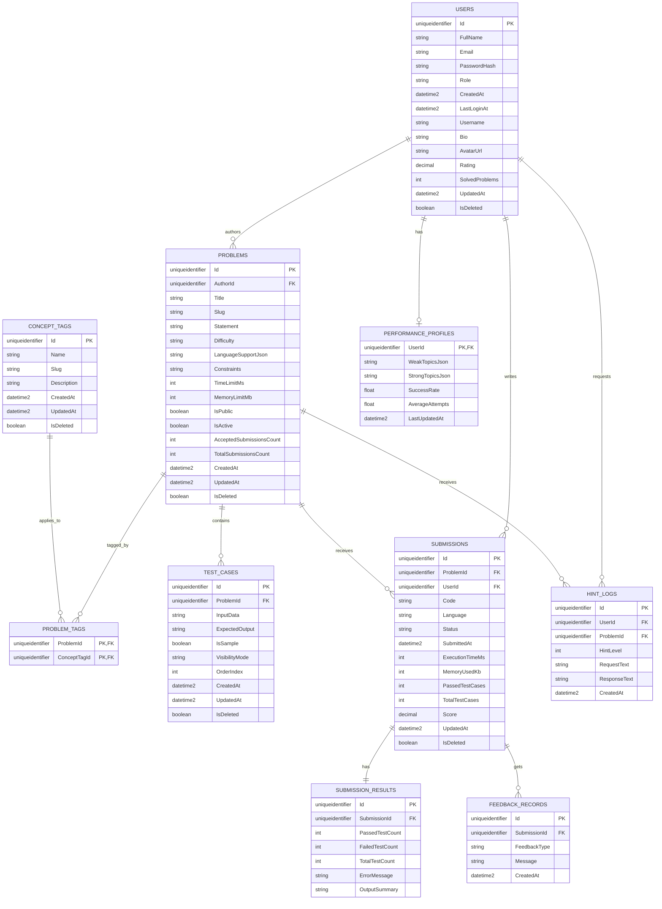

# Codify — ER Diagram Reference

## Notes

- `ProblemTags` uses a composite primary key of `(ProblemId, ConceptTagId)`.
- `SubmissionResults.SubmissionId` is unique, so each submission has at most one result row.
- `Problems.AuthorId` is nullable and uses `ON DELETE SET NULL`.
- `HintLogs` is present in the schema even though hint persistence is not yet wired into runtime.
- Soft-delete query filters exist on `Users`, `Problems`, `ConceptTags`, `TestCases`, and `Submissions`.
